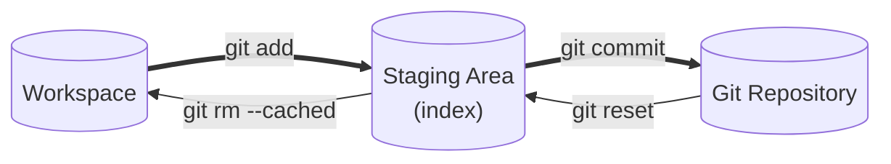

# git commit 的背后

让我来画一张图

由于我们到目前都没有提交过, 我们只知道 staging area 和 workspace 是分开的 ( 那个 objects 目录中保存的各种[文件对象](git%20add.md#使用%20`-t`%20参数查看文件类型)(可以复习一下哟) ), 这一节我们将使用这张图的**粗线部分**来进行**时间上正向**的版本控制

![[Pasted image 20250731163213.png]]

重新初始化一个仓库, 并将两个文件加入 git 追踪, 将两个文件加入暂存区后修改一个文件, 并将其再次加入暂存区. 于是 `file1.txt` 有了两个 blob 对象 (`08219d` 和 `35a687`), `file2.txt` 拥有一个 blob 对象指向它 (`30d67d`).

文件结构如下:

![[Pasted image 20250731163824.png]]

## `git commit` 命令流程

在键盘中敲下 `git commit`, 这将使用你 git 配置中的 core.editor 指定的文件编辑器打开一个文件

我将这次提交命名为 "新的提交", 保存这个文件, git 将自动读取这个文件并将**索引区中的所有更改**提交到 git repository 中

注意到运行这条命令后多了几个文件:

![[Pasted image 20250731163641.png]]
首先: objects 目录中出现了一个新的文件对象 (`1dab8d`) , 还有就是 COMMIT_MESSAGE 文件, 刚才编辑的就是那个文件.

> [!info]
> 当然你也可以忽略这个 COMMIT_MESSAGE 中的信息, 直接给一条提交信息
> 
> `git commit -m "你的提交信息"`

提交成功后的消息应该长这样:

![[Pasted image 20250731164047.png]]
然后文件结构应该长这样:
![[Pasted image 20250731164109.png]]

发现有又了一个**文件对象** (`dd8e0a`) , 还多了一个 `logs` 文件夹, 同时 `refs/heads` 文件夹中也多了一个 `main` 文件

---

由于刚才的命令实际上是**分两步执行**的, 这里也分两步分析:

1. 按下 `git commit` 后立即做出的改变
2. 完成 `COMMIT_MESSAGE` 后的改变

## `git commit` 按下后

### 文件对象

我们先来查看 `git commit` 后多出来的**文件对象**

![[Pasted image 20250731164225.png]]
可以看到, 这是一个新的 git 对象类型! 同时拥有的文件内容是 `git ls-files <some files> -s` 的信息! 我们来验证一下哈希值是不是对的

![[Pasted image 20250731164313.png]]
上下对照**发现完全一样**, 这表明 `tree` 对象中存储了**更新**的文件的信息 (为什么说是更新, 自己去试试). 同时 `tree` 对象中 `file1.txt` 对应的的那一个 `blob` 对象是提交前最新的 `file1.txt` 的对象 (`35a687`, 老的那个是 `08219d`)

来捋一捋: 一个 `tree` 对象中保存了文件的**记录和标识** (哈希值的确可以当作标识), 而一个 `blob` 对象对应着一个 `workspace` 中的**文件版本** ( 曾经修改的文件的 `blob` 对象不会删除 ).

## `COOMMIT_MESSAGE` 提交后

### 文件对象

按照同样的方法, 相信可以想出来吧

先来查看 `COMMIT_MESSAGE` 提交后多出来的**文件对象**

![[Pasted image 20250731165153.png]]
1. **文件对象的类型**是 `commit`, 从名字来看就知道这**标示着一次提交**. 
2. 此文件中的内容里有一个 `tree` 对象, 好巧不巧, 就是**上面那个 `tree` 对象 ( `1dab8d` ). **
3. 还保存了作者信息和提交者信息, 通过 `git config -l` 可以查看到相应的信息. 
4. 然后还有**时间戳** ( `1753950975` )
5. 那个 ( `+0800` ) 就是表示东八区啦

### HEAD 文件 和 .git/refs/heads

来看看 HEAD 文件里有些什么吧

![[Pasted image 20250731172500.png]]

这里保存了一个目录, 根据这个目录我们找到对应的文件

![[Pasted image 20250731172126.png]]
可以发现, 这里保存的就是 `commit` 对象 ( `dd8e0a` ), 这说明其实这个文件保存的是当前的版本的哈希值. 通过 HEAD 文件指向, 有什么好处呢? 答案将会在下节揭晓

## 稍微总结一下

> [!summery]
> 一次提交分两步:
> 1. `git commit`, **生成 `tree` 类型的对象**, 汇总自上次提交以来的**所有文件现在对应的 blob 对象** (这个信息从哪里来? **index 文件中呀** . 见 [[工作区和索引区#index 文件是什么?]])
> 2. 提交, 生成** `commit` 类型的对象**, 获取文件修改的作者信息和提交者信息, 还有此次提交的具体时间, 并将 COMMIT_MEEESAGE 信息保存下来, 修改 / 生成 HEAD 文件, 记录提交

## 更进一步!

 现在我们都只是在**仓库根目录下**操作, 如果又目录呢? 现在文件比较多, 我们**重新创建一个仓库**

![[Pasted image 20250802130735.png]]

### 步骤
#### 创建一个文件夹

文件夹中保存一个文件, 然后初始化一个 git 仓库. 完事后大概长这样:

![[Pasted image 20250802130847.png]]

#### 执行 `git add .`

这里的 `.` 表示当前目录下的的所有文件

![[Pasted image 20250802130952.png]]

记下这个 `blob` 对象的哈希: `35a687`

#### 执行 `git commit`

输入 `git commit` 后, 文件结构大概长这样

![[Pasted image 20250802131142.png]]

多了两个对象, `09855b` 和 `5c6ddd`

#### 完成提交

我的提交信息输入 `第二次提交`, 各位倒是可以随意, 完成后文件结构如下

![[Pasted image 20250802131600.png]]

多了一个对象, `fe42e1`

### 分析一下

让我们按照时间顺序查看各个对象的内容

#### 执行 `git add .` 后

![[Pasted image 20250802131849.png]]

当然这是一个 `blob` 对象, 想都不用想

#### 执行 `git commit` 后

我们已经知道, `git commit` 执行后会收集 index 中的所有文件信息, 生成一个 `tree` 对象

这里比较奇怪, 明明只有一个文件, 为什么会多出两个对象, 我们查看一下 `index` 文件

![[Pasted image 20250802132532.png]]

可以看到 index 文件中有一个 `some-dir/file1.txt`, 说明这个 `index` 文件保存了当前仓库的目录结构

接下来看看第一个 `tree` 对象:

![[Pasted image 20250802132747.png]]

第二个:

![[Pasted image 20250802132129.png]]

可以看到这里的结构是这样的: `some-dir` 的 `tree` 对象指向了 `file1.txt` 的 `tree` 对象, 而 `file1.txt` 的`tree` 对象指向了 `file1.txt` 的`blob` 对象, 这就像是指针套指针的关系.

#### `git commit` 完成后

毫无疑问, 这一定是一个 `commit` 对象

![[Pasted image 20250802133250.png]]

查看结果, 不出所料

## 总结

> [!summery]
> 在前面中我们学习到了三种对象, 分别为: `blob` (意为二进制大型对象), `tree` 和 `commit` 对象
> 
> 1. `blob` 对象在 `git add` 的时候生成
>     - `index` 文件会更新文件对应的信息以**保证其指向最新版本的** `bolb` 对象
>     - `blob` 对象是一个压缩文件, **完整的保存了对应文件**
>     - 表示一个文件在时间上的锚点
> 2. `tree` 对象在 `git commit` 的时候生成
>     - 由 `index` 文件中的所有信息生成
>     - 一次提交中成的 `tree` 对象一起可以**形成树形结构** (准确一点应该叫森林, 因为并没有对应项目根节点的 `tree` 对象, 事实上 `commit` 对象就是整个仓库的根节点).
>     - 这个结构**与仓库文件树一一对应**, `tree` 对象对应一个文件夹或者文件 ( `UNIX` 系统中的 `inode` )
>     - 叶子节点表示一个文件, 其他表示目录. **叶节点指向一个 `blob` 对象**, 这个 `blob` 对象**一定是截至此次提交前的最新的版本**
> 3. `commit` 对象在 `git commit` 完成 ( 填入 COMMIT_MESSAGE 后 ) 生成
>     - `commit` 对象将散落的 `tree` 整合到一棵树中, 对象充当整个**仓库的根节点**
>     - 保存了提交者, 提交时间等信息
>     - 保存了**上一次提交的指针**
>     - 表示一次提交
> 
> > [!ps]
> > 上面说的 xxx 指向 yyy 其实是 xxx 保存了 yyy 对象的哈希值

> [!summery]
> `.git/HEAD` 文件其实比较类似操作系统中的**软链接**的概念, 它指向了**某一个分支的 head 文件** (`refs/heads/<分支名>`)
> 而这个`refs/heads/<分支名>` 文件**表示了对应分支现在在哪一个版本中**  (通过保存对应 `commit` 对象的哈希值)