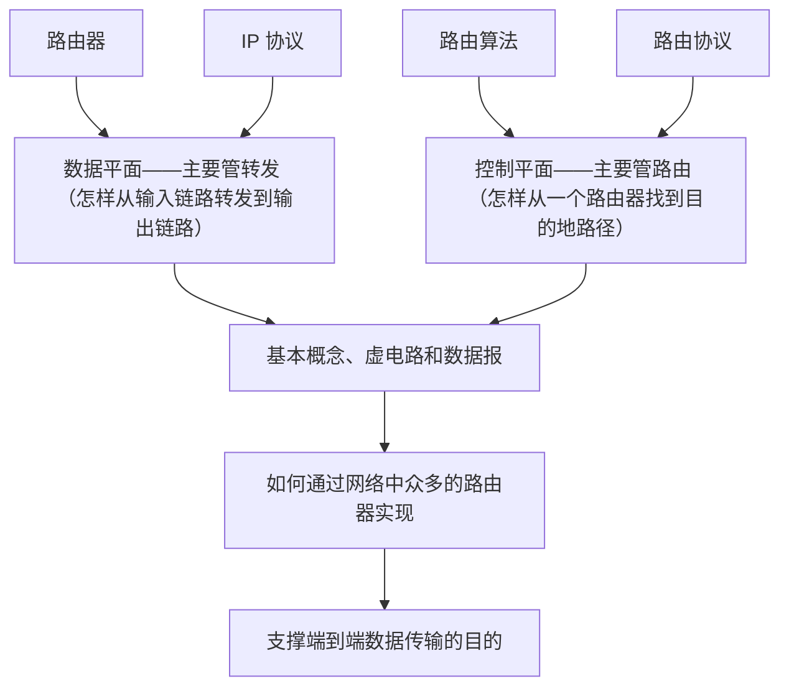

# 基本概念

## 路由器

- 分组交换方式
    - 第一代路由器：**经内存交换**，数据报通过总线两遍
    - 第二代路由器：**经总线交换**，数据包通过总线一遍
    - 第三代路由器：**经互联网络交换**，看书 P208，总体来说类似于火车道岔网络
- 队列
    - 输入排队：某个瞬间来的分组数量大于路由器能够处理的分组数量
    - 输出排队：多个分组需要被转发到同一个输出端口
- 分组调度
    - 先进先出
    - 优先权排队
    - 循环和加权公平排队
- 丢弃策略
    - 抛头抛尾
    - 根据优先级丢弃
    - 随机丢弃

## 数据报

## 网络层两大功能

- 路由：运行路由选择算法，生成路由表
- 转发：从输入和输出链路减缓数据包，根据路由表进行分组转发

# 路由器组成 交换网类型

# IPv4

- 概念：IPv4标识的是输入输出端口（接口），而不是某一个设备
- 点分十进制表示法
- IP数据报首部长度通常为20字节（与TCP相同）
- TTL
- [数据报分片]([IP数据报分片机制详解-CSDN博客](https://blog.csdn.net/lisayh/article/details/79162515))（计算）
    - id：是否来自同一个原始分组
    - flags：两个标识——MF、DF是否需要分片、是否是最后一片
    - offset：偏移量
- 编址
    - 分类地址（五类地址）
        - 0打头，网络号7位，主机号24位
        - 10打头，网络号14位，主机号16位
        - 110打头，网络号21位，主机号8位
        - 1110打头，剩下都是组播地址
        - 11110打头，保留作为后续使用
    - 划分子网
        - 子网号和主机号，是内部的事情，隔绝
        - 构成超网：网络前缀加主机号（CIDR，路由聚合）
- 获取IPv4地址
    - **ICANN（ISP 向 ICANN 申请获得一个地址块）**
    - 划分子网
    - 静态 / **动态配置——DHCP（应用层协议、四报文 Discover Offer Request Ack）**
        - Discover，新来的主机的 IP 地址为 0.0.0.0，向 255.255.255.255 地址广播，使得 DHCP 服务器发现这个新的主机（src: 0.0.0.0, dest: 255.255.255.255, port 67）
        - Offer，DHCP 服务器向新来的主机广播分配的地址（src: DHCP 服务器地址, dest: 255.255.255.255, port: 68, 报文内容：分配的 IP 地址）
        - Request，新来的主机依旧使用 0.0.0.0 **（由于可能有两个新的主机同时申请IP地址，不能直接就使用这个 IP 地址，不然就重名了）** 这个地址向 255.255.255.255 地址广播，请求使用此 IP 地址 (src: 0.0.0.0, src: 255.255.255.255, 内容：申请获取此 IP 地址)
        - Ack，DHCP 服务器向新来的主机发送 Ack 表示已经获取此 IP 地址的使用权（依旧是广播）
> **DHCP 报文全部为广播报文**，由新主机发送的报文的目标端口号为67，由 DHCP 服务器发送的报文的目标主机端口号为 68
- NAT（Network Address Translation）
    - 网络地址转换
    - 内外隔离
        - 私有：地址仅本网络有效
        - 对外：仅需一个地址
        - 内网设备的 IP 和端口映射到 NAT 路由器的 IP 和端口
        - 内网穿透

# IPv6

- 地址位数 128 位，8组，每组 16 位，用 8 个 4 位 16 进制数字表示
- IPv6 头部长度 40 字节
- 表示，每组用16进制数表示
- 与 v4 对比
    - 增：优先级、流标签、下一首部
    - 删：分片相关、校验和
    - 变：ICMPv6
- 兼容：隧道技术（将 IPv6 的分组封装到 IPv4 分组中）

---

# 路由算法

## LS Dijkstra算法

- 震荡

## DV Bellman-Ford方程

$$
D_x(y)=min\{c(x,v)+D_v(y)\}
$$

$D_a(b)$表示由 a 到 b 的路径长度，$c(x,v)$表示 x 到邻居 v 的最短路径

- 好消息传得快，坏消息传的慢
- 解决方案：毒性逆转，设定max值

    - **毒性逆转**：若 A B C 直接线性相连，A 和 C 直接相连，B 和 C 直接相连，B 为 A C 通信的中继。在稳定之后A 和 B 的连接切断。B 去问 C，有没有去 A 的路径，C 发现自己去往 A 需要通过 B，心里一凉，这下通过不了了，并迅速将这个消息传给其他的节点，于是给 B 说 A 去不了，希望能够阻止 B 的想法。但是如果不是线性相连的，此时 B 也在向其他节点询问，只要有一个节点先于 C 应答回去说我能到，这就完了

## 两种算法比较

- 报文复杂度
    - LS 算法要在全网泛洪
    - DV 算法仅在邻居之间发送
- 收敛速度
    - LS 收敛快
    - DV 算法收敛满，还可能遇到路由选择环路和无穷计数
- 稳健性
    - LS 是集中的，一台路由器发生错误，不经过这台路由器的路径可能不会发生改变
    - DV 是分布的，每条消息都蕴含着所有路由器的信息，一定会发生错误
# 路由协议

- 分层自治 自治系统 AS（Autonomous System）
- AS 内协议：RIP、OSPF、IGRP
    - RIP 协议基于 DV 算法，以跳数作为代价，最多不超过 15 跳，每隔 30 秒交换一次信息，最多支持 25 个子网（通过 UDP 连接通告）
    - OSPF 协议基于 LS 算法
        - 安全，报文是经过认证的
        - 允许有多种代价类型同时对路径选择产生影响
        - 支持层次化 OSPF，本地的和骨干的
- AS 间协议：BGP（Border Gateway Protocol，通过 TCP 连接通告）
    - eBGP（external） 收集自治系统的信息向外部进行通告，向外部通告我已经知道的信息。基于距离矢量，但是改进过了，通过将完整路径传给其他人来解决选择环路和坏消息传得慢
    - iBGP （internal）将获取的子网信息传遍 AS 内部的所有路由器

> 建立转发表过程：热土豆路由
>
> 如果有两条路径都能到达外部的节点 x，要通过延迟最小的网关把这个消息传出去，计时这条延迟最小的路径会经过更多的自治系统（赶紧端走，管你这那的）

BGP 路由选择

1. 查看路由偏好，比如说不走敌国的自治系统（安全优先）
2. 然后从选出来的路由中选择一个 AS-PATH 路径最短的（总体性能）
3. 然后在选出来的路由中，使用热土豆路由选择下一跳（局部性能）
4. 如果仍然有多条，那么使用 BGP 表示一条路径并随机选择（代价相同）

> ICMP 和 SNMP 协议