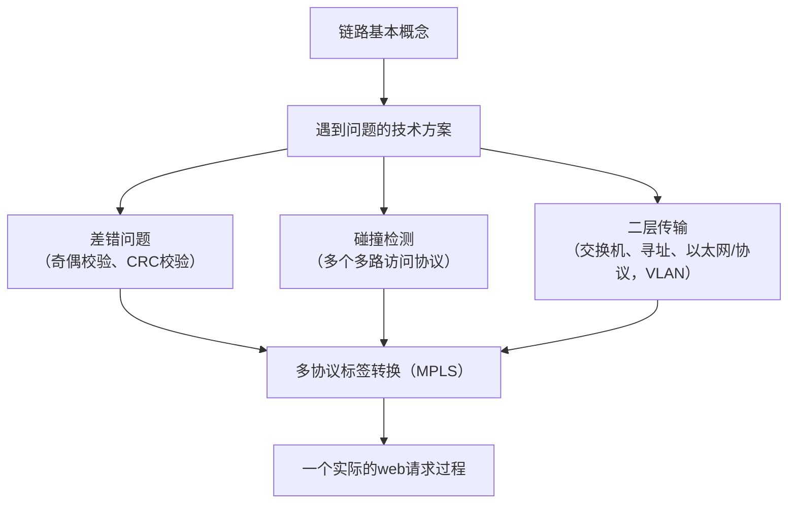

# 基本概念

## 三个基本问题

### 封装成帧

定界符（8字节），前七个字节用于同步、最后一个字节用于定界

### 透明传输

比特填充、字符填充

### 差错检验

- 奇偶校验
- 校验和（加反加判、溢出回卷）
- CRC（异或、位移）循环冗余校验

> 为 d 位数据生成校验码，生成式 G 具有 r 位
>
> 1. 数据左移 r - 1 位
> 2. d / G 得到的余数就是 r - 1 位校验码
>
> 收到了 d + r 位数据，如何校验
>
> 3. 将 d 位数据位 和 r 位校验位拼合在一起，看是否能被 G 整除

## 两个典型标准

### 以太网 802.3

### 无线网 802.11

## 差错检验（[同上](#差错检验)）

## 碰撞问题

MAC 协议

- 信道划分（TDM**A**、FDM**A**、CDM**A**）
- 随机接入
    - 纯ALOHA
        - 当有帧需要传输的时候，立马传输，也拥有 **p 坚持**
        - 信道效率最高为 17.5%
    - 时隙ALOHA
        - 信道的每一个节点时间同步，每个节点只能在属于自己的时间的开始发送帧
        - **p 坚持**，如果发生了碰撞，碰撞的每一个节点通过能量等信息知晓碰撞的发生，**然后这些节点各自都有 p 的概率重试，1 - p 的概率此次放弃，在下一个时隙也有 p 的概率重试**。信道效率最高为 37.5%
    - **CSMA，CSMA/CD（以太网，载波侦听、多路访问、冲突检测），CSMA/CA（无线网络，载波侦听、多路访问、冲突避免）**
        - **在发送帧之前侦听信道是否在使用中** CS（Carrier Sense，载波侦听），但因为有传播延迟的存在，CS 并不能完全避免冲突，且信道越长，延迟越大，发生冲突的可能性越大
        - **CD**（Collision Detection，冲突检测）边说边听，使用能量作为判断依据，因为在有线信道中，能量衰减是很微弱的。
            - **如果没有冲突，则视为发送成功**；如果**检测到冲突**，那么**放弃**，**之后尝试重发**。
            - **强化冲突**：如果检测到了冲突，那么发送一个极强的信号，告诉信道上的每一个节点发生了碰撞（jam 信号）
            - **尝试重发**：二进制指数退避算法
                > 发生冲突完了之后，恢复通信，和 **p 坚持**类似，但是概率不是固定的，等的时间也不是固定的，例如：
                >
                > 有 k 个设备同时发送导致了碰撞，立即终止，这 k 个设备中，**每个设备从 $[0,2^k-1]$ 这些数字中随机选择一个数字（此处记为 i）**，然后等待 **i 个 512 倍位时**，等待完成后，侦听信道是否被占用，如果没有被占用，那么发送这个帧
            - 效率比 ALOHA 高，而且简单、廉价
        - **CA** （Collision Avoid，冲突避免），而在 WLAN 中，能量衰减很快，平方反比，无法使用 CD，而且无线网的噪声很多
            - **一旦拿到信道，直接全部发送**，不用 CD，也没法 CD，做了 CD 也没用。而且在 WLAN 中，碰撞和成功关系没有那么大
            - **监听到信道占用的时候**直接**随机一个回退值**，选出来的数值在**信道空闲时减一**，减到 0 时发送帧
            - **收到帧的节点在侦听一个很短的时间后迅速发出一个 ACK**，监听时间比发送时短
- 轮流机制
    - 轮询
        - 主节点邀请从节点说话
        - 存在单点故障和轮询交流开销
    - 令牌
        - 控制令牌循环共一个节点到下一个节点传递
        - 令牌报文是一种特殊的帧
        - 令牌开销，只有到令牌轮到我的时候我才能发，单点故障（token 坏了就没法用了）

## 二层传输

- 交换机（自学习）和HUB的区别 
- MAC（Medium Access Control）地址（48位，分为6组）、寻址、ARP协议
    - 用于子网内部区分设备
    - ARP 协议（IP 与 MAC 之间的映射）
        - 首先广播（MAC 地址 48 位全为 1），问：IP 为某个值的人，你 MAC是多少？然后将结果缓存在 ARP 表中（TTL 为 20 分钟）

- 以太网
    - 无连接（不握手）
    - 不可靠（没有 ACK 或者 NAK）
    - 采用二进制退避的 CSMA/CD

- VLAN、MPLS

# 无线网络

## 名词

BS、cell、SINR、两个模式、主要发展历史

## 802.11

主动/被动扫描方式

## 移动性

直接/间接路由过程